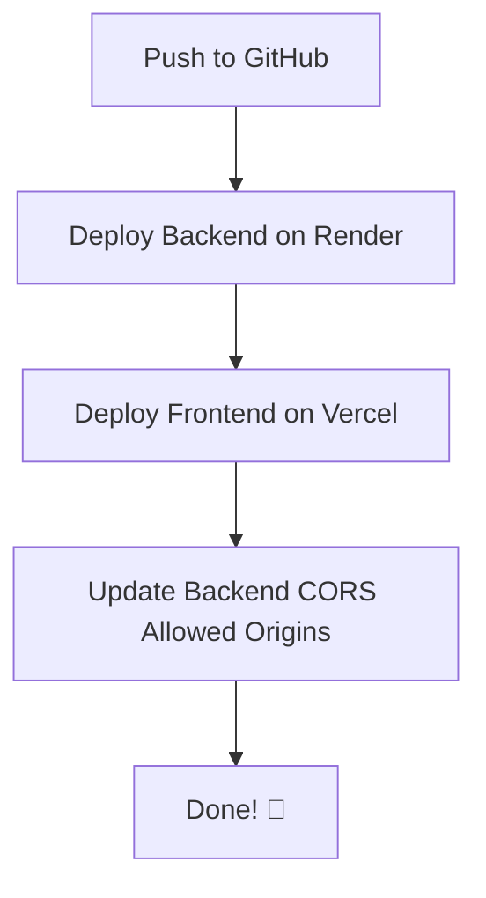

# CodeVerse — Deployment Guide 🚀🌌

### Render Deployment (Blueprints)

This project is ready to be deployed on Render using the included `render.yaml` Blueprint.

#### Steps to Deploy:
1.  **Push your code** to a GitHub repository.
2.  **Go to Render Dashboard** and click **New > Blueprint**.
3.  **Connect your repository**.
4.  Render will automatically detect the `render.yaml` file and set up:
    *   A managed **PostgreSQL** database.
    *   A **Web Service** for the Spring Boot backend.
5.  **Environment Variables**: The Blueprint automatically links the database to the backend. You can add additional variables like `JWT_SECRET` in the Render dashboard if needed.

#### Manual Configuration (if not using Blueprints):
- **Build Command**: `docker build -t backend -f backend/Dockerfile backend` (if running locally/manually)
- **Start Command**: `java -jar app.jar` (handled by Dockerfile)
- **Database**: Add a PostgreSQL instance and set `SPRING_DATASOURCE_URL`, `SPRING_DATASOURCE_USERNAME`, and `SPRING_DATASOURCE_PASSWORD` environment variables in your Web Service.

#### Local Development
The project still defaults to **H2 in-memory database** for local development. To use PostgreSQL locally, set the environment variables in your IDE or local shell.

---

This guide provides comprehensive, step-by-step instructions for deploying the **CodeVerse** application to production. 

* 🍃 **Backend (Spring Boot)** is deployed to **[Render](https://render.com/)** using Docker.
* ⚛️ **Frontend (React + Vite)** is deployed to **[Vercel](https://vercel.com/)** as static hosting.

---

## ⚡ Fast-Track Deployment (5-Minute Summary)

If you are already familiar with Render and Vercel, here is the rapid checklist:



1. **Push Code to GitHub**: Make sure your local repository is pushed to your remote origin (`git push origin main`).
2. **Deploy Backend (Render)**:
   * Create Web Service → Connect GitHub.
   * Root Directory: `backend` | Runtime: `Docker` | Plan: `Free`.
   * Add Env Vars: `SPRING_PROFILES_ACTIVE=prod`, `JWT_SECRET=<your-secret>`, `CORS_ALLOWED_ORIGINS=http://localhost:5173`.
3. **Deploy Frontend (Vercel)**:
   * Import GitHub repo → select `frontend` folder as Root.
   * Framework: `Vite` | Add Env Var: `VITE_API_URL=<your-render-backend-url>` (no trailing slash).
4. **Update CORS**: Go back to Render and update `CORS_ALLOWED_ORIGINS` to your Vercel URL.

---

## 📋 Prerequisites

Before starting, ensure you have:
* [x] A **GitHub** repository containing your project (e.g. `https://github.com/Himanth3/pycoder_FullStack`)
* [x] A **Render** account (Sign up at [render.com](https://render.com/))
* [x] A **Vercel** account (Sign up at [vercel.com](https://vercel.com/))

---

## 🍃 Step 1: Backend Deployment (Spring Boot → Render)

Render reads the `Dockerfile` inside the `backend` folder and compiles the Spring Boot jar file automatically using a multi-stage Docker build.

### 1.1 Local Verification (Optional but Recommended)
Verify that your backend compiles successfully locally:
```powershell
cd backend
.\mvnw.cmd clean package -DskipTests
```
This should generate a `BUILD SUCCESS` message.

### 1.2 Create Web Service on Render
1. Navigate to your [Render Dashboard](https://dashboard.render.com/).
2. Click **New +** in the top right and select **Web Service**.
3. Under **Connect a repository**, select your GitHub repository.
4. Fill in the configuration details as follows:

| Field | Configuration Value | Why this is needed |
| :--- | :--- | :--- |
| **Name** | `codeverse-backend` | Unique identifier for your service URL |
| **Region** | Choose the one closest to you (e.g., `Singapore` or `Oregon`) | Minimizes network latency |
| **Branch** | `main` | Deploys code changes from this branch |
| **Root Directory** | `backend` | Tells Render to run commands inside the `/backend` subfolder |
| **Runtime** | `Docker` | Executes using the project's root `Dockerfile` |
| **Instance Type**| `Free` | Free tier hosting |

> [!NOTE]
> Render will automatically detect `backend/Dockerfile` and execute the multi-stage build (Maven packaging followed by Eclipse Temurin Java runtime).

### 1.3 Add Environment Variables
Scroll down to the **Environment Variables** section on Render (or go to the **Environment** tab after creating the service) and add the following keys:

| Key | Value | Description |
| :--- | :--- | :--- |
| `JAVA_VERSION` | `21` | Configures Java runtime environment version. |
| `JWT_SECRET` | `generate-a-long-random-string-at-least-32-chars-long` | Used to sign and verify JWT tokens securely. **Do not share this.** |
| `SPRING_PROFILES_ACTIVE` | `prod` | Activates production configuration. |
| `CORS_ALLOWED_ORIGINS` | `http://localhost:5173` | Temporary CORS permission. (Will be updated once Vercel is live). |

### 1.4 Trigger Deployment
1. Click **Create Web Service** at the bottom of the page.
2. Monitor the logs. The build will take around **3 to 5 minutes** to complete.
3. Once the logs say `Static files served...` or `Started PycoderBackendApplication`, your backend is live!
4. **Copy the Render URL** provided at the top-left of the service page. It should look like:
   `https://codeverse-backend.onrender.com`

> [!TIP]
> You can verify the backend status by visiting the health check page in your browser:
> `https://codeverse-backend.onrender.com/api/health`
> It should return: `{"status":"UP"}`

---

## ⚛️ Step 2: Frontend Deployment (React → Vercel)

Vercel hosts the React + Vite static bundle and serves it instantly via CDN.

### 2.1 Import to Vercel
1. Go to your [Vercel Dashboard](https://vercel.com/).
2. Click **Add New...** → **Project**.
3. Import your GitHub repository from the list.

### 2.2 Configure Build & Output Settings
Under the **Configure Project** section, edit the settings:

* **Framework Preset**: Select `Vite` (usually auto-detected).
* **Root Directory**: Click *Edit* and select the `frontend` folder, then click **Continue**.
* **Build Command**: `npm run build`
* **Output Directory**: `dist`

### 2.3 Add Environment Variables
Expand the **Environment Variables** section and add:

* **Key**: `VITE_API_URL`
* **Value**: `https://codeverse-backend.onrender.com` (Your copied Render backend URL)

> [!WARNING]
> Do **NOT** put a trailing slash `/` at the end of the `VITE_API_URL` (e.g., use `https://example.onrender.com`, not `https://example.onrender.com/`).

### 2.4 Deploy
1. Click **Deploy**.
2. The compilation should take less than **2 minutes**.
3. Once completed, Vercel will give you a production domain (e.g., `https://codeverse.vercel.app`).
4. **Copy this URL**.

---

## 🔗 Step 3: Link Services (CORS Update)

Since the frontend is now running on a separate domain (`vercel.app`), your backend needs to allow it to make requests.

1. Go back to your [Render Dashboard](https://dashboard.render.com/).
2. Click on your `codeverse-backend` service.
3. Go to the **Environment** tab.
4. Locate the `CORS_ALLOWED_ORIGINS` variable and update its value to your Vercel URL:
   * **Old Value**: `http://localhost:5173`
   * **New Value**: `https://codeverse.vercel.app` *(Replace with your exact Vercel URL)*
5. Click **Save Changes**.
6. Render will automatically redeploy the backend with the new setting (takes 1-2 minutes).

---

## 🔐 Default Access Credentials

For testing and verification, the database includes a pre-seeded account on startup (created by [DataInitializer.java](file:///d:/projects/CodeVerse/backend/src/main/java/com/pycoder/backend/config/DataInitializer.java)). 

You can immediately log into the production application using these credentials:
* **Username**: `user`
* **Password**: `password123`
* **Email**: `user@codeverse.com`

---

## 🛠️ Troubleshooting & Logs

### H2 Database Console
The in-memory database is active for testing. You can view the tables at:
`https://<your-backend-url>.onrender.com/h2-console`
* **JDBC URL**: `jdbc:h2:mem:testdb`
* **User**: `sa`
* **Password**: *(Leave blank)*

### Mixed Content Errors
If the application loads but login fails, press `F12` to open Developer Tools and check the Console. If you see a `Mixed Content` error:
* Ensure your `VITE_API_URL` environment variable uses `https://` and not `http://`.

### CORS Blocked
If you see a CORS error in the browser:
* Ensure your backend `CORS_ALLOWED_ORIGINS` exactly matches your Vercel URL.
* Confirm there is no trailing slash `/` at the end of the URL in either Render or Vercel configurations.

---

*Deployed with ❤️ using React ⚛️ + Spring Boot 🍃*
